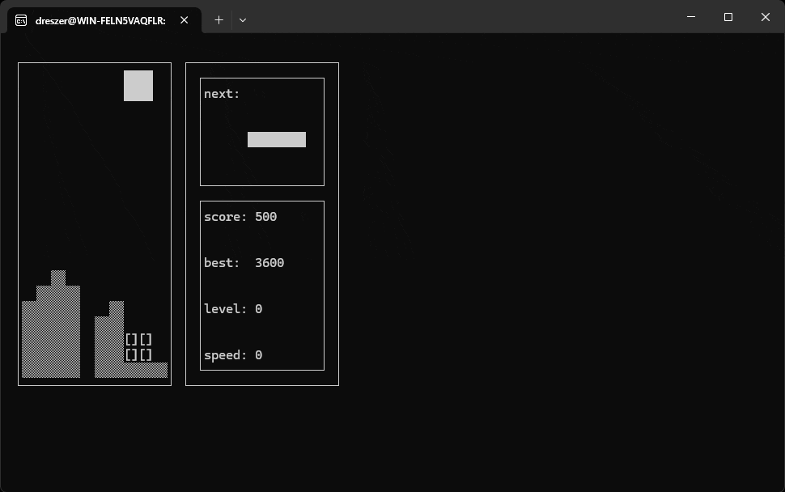

# Tetris in C

Educational project, interactive version of Tetris in C language, using ncurses library for command-line graphics.



## Installation

- Debian/Ubuntu Linux and MacOS are supported

You will need ncurses library installed to run the game, to install on Debian/Ububntu Linux systems:
```Shell
sudo apt-get install libncurses5-dev libncursesw5-dev
```
After installing ncurses, run ```make``` to compile executable file ```tetris```, run this file to start the game.

## Controls

- Arrow keys(left, right, down) to control the tetrominoe
- Spacebar to rotate
- 'P' or 'p' button to pause and unpause
- Enter to start the game and restart after gameover
- Escape to close the game

## Uninstall
- To uninstall game and clean all the unneccessary files
  ```Shell
  make clean
  ```
- To remove high score file
  ```Shell
  make clean_record
  ```
